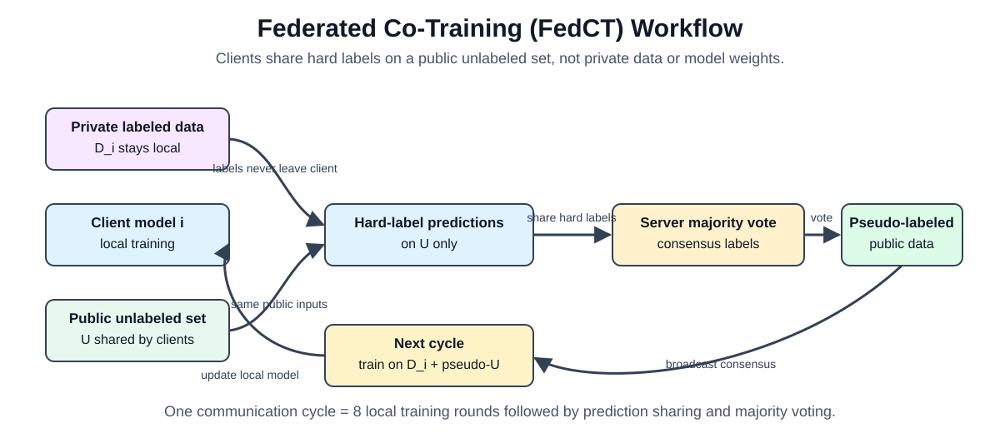
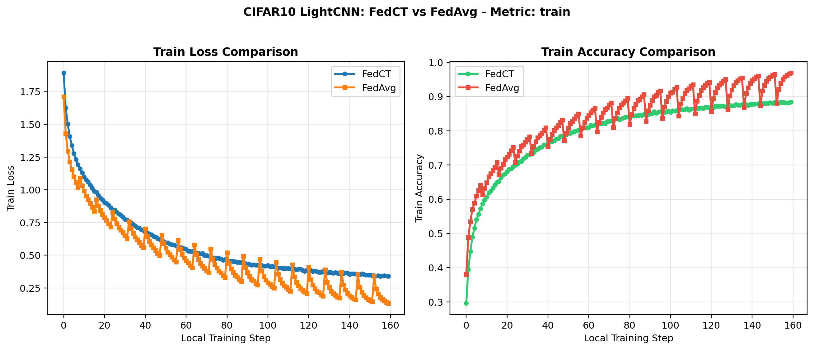
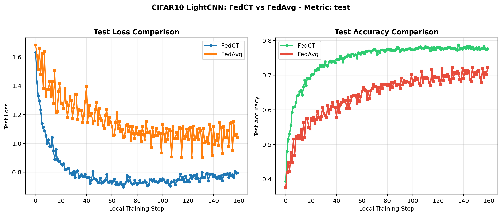
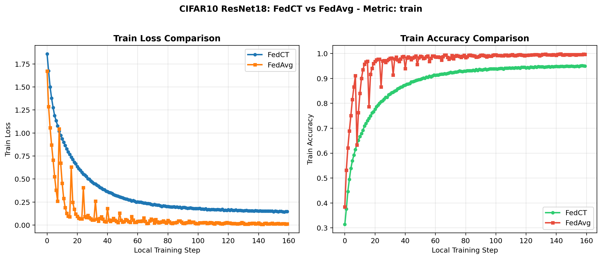
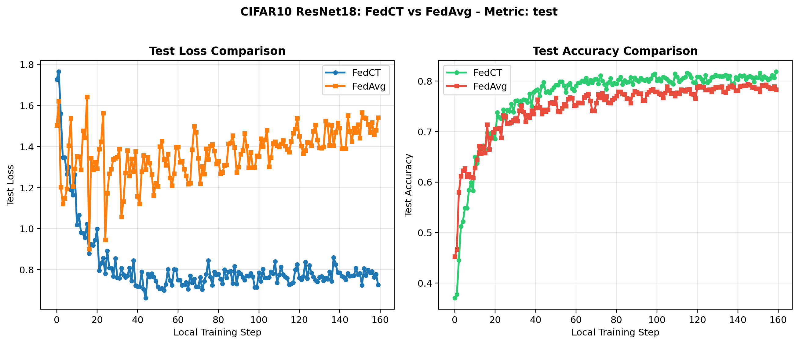
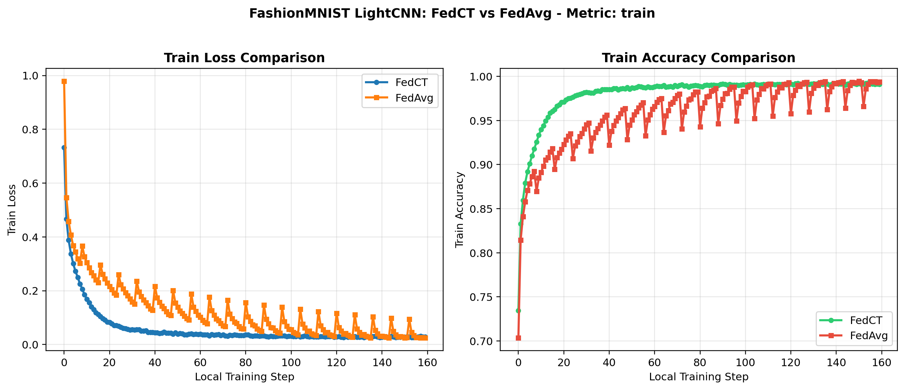
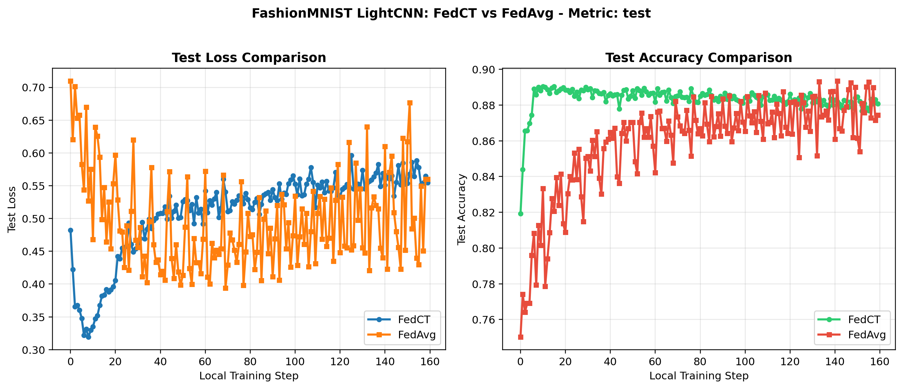
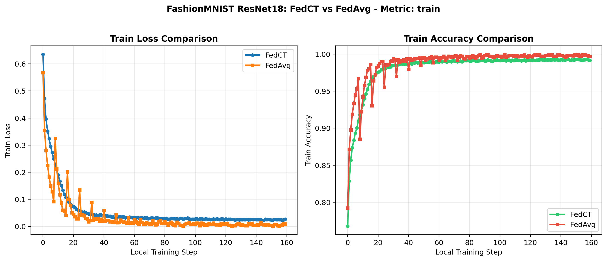
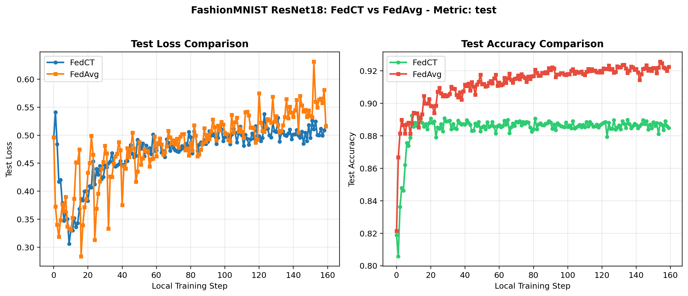

# Federated Co-Training with Flower: Preliminary Results Draft

## 1. Overview

This project implements **Federated Co-Training (FedCT)** using the Flower framework. The implementation follows the central idea of *Little is Enough: Boosting Privacy by Sharing Only Hard Labels in Federated Semi-Supervised Learning* by Abourayya et al.: clients do not share private data or model weights. Instead, each client trains locally, predicts **hard labels** on a shared public unlabeled set, and the server builds consensus pseudo-labels through majority voting.

The comparison baseline is **Federated Averaging (FedAvg)**. In this project, FedAvg is used only as a baseline for comparison and is executed through Flower's built-in `FedAvg` strategy. The FedAvg baseline therefore performs server-side weight aggregation through Flower, while FedCT remains the main custom implementation.

## 2. Relation to the Paper

The paper argues that FedCT can retain model quality comparable to traditional federated learning while improving privacy because it shares only hard labels on public unlabeled examples. This is different from FedAvg, where clients send model parameters or model updates to the server. The core privacy motivation is that hard-label communication leaks less information than parameter sharing or soft-label sharing, while still allowing clients to benefit from each other's predictions.

The implementation in this project follows the same high-level mechanism:

1. Each client trains on its private labeled dataset.
2. Each client predicts hard labels on a shared public unlabeled dataset.
3. The server applies majority voting to produce consensus pseudo-labels.
4. In the next communication cycle, clients train on private labeled data plus pseudo-labeled public data.



## 3. Experimental Setup

| Item | Value |
|---|---|
| Framework | Flower simulation |
| FedCT app | `fedcot/client_app.py`, `fedcot/server_app.py`, `fedcot/task.py` |
| FedAvg baseline | `baselines/fedavg_flower/app.py` using Flower built-in `FedAvg` |
| Number of clients | 5 |
| Datasets | CIFAR10, FashionMNIST |
| Architectures | LightCNN, ResNet18 |
| Optimizer | Adam |
| Learning rate | 0.001 |
| Private batch size | 64 |
| Public batch size | 32 |
| Public unlabeled size | 100 |
| Communication cycles | 20 |
| Local rounds per FedCT cycle | 8 |
| Total FedCT Flower fit rounds | 160 |
| GPU allocation | 0.2 GPU per client in the shell configuration |

### Communication Round Definition

In the FedCT implementation, one **communication cycle** means:

```text
8 local training rounds
then prediction sharing on the public unlabeled set
then server-side majority voting
then consensus pseudo-labels are used in the next cycle
```

Flower internally counts each local training round as a server round for FedCT. Therefore:

```text
20 communication cycles x 8 local rounds = 160 Flower fit rounds
```

For FedAvg, one Flower round is one aggregation round. Each selected client trains locally for 8 epochs and then sends model weights to Flower's built-in FedAvg strategy for aggregation.

## 4. Results

The table below reports the final train and test accuracies parsed from the latest experiment logs for each dataset and architecture pair.

| Dataset | Model | FedCT Train Acc | FedCT Test Acc | FedAvg Train Acc | FedAvg Test Acc | Test Gap |
|---|---|---:|---:|---:|---:|---:|
| CIFAR10 | LightCNN | 0.8845 | 0.7763 | 0.9688 | 0.7220 | +0.0543 |
| CIFAR10 | ResNet18 | 0.9490 | 0.8187 | 0.9964 | 0.7833 | +0.0354 |
| FashionMNIST | LightCNN | 0.9911 | 0.8807 | 0.9936 | 0.8744 | +0.0063 |
| FashionMNIST | ResNet18 | 0.9911 | 0.8871 | 0.9970 | 0.9224 | -0.0353 |

Across these four runs, FedCT achieved higher final test accuracy in three cases and lower final test accuracy in one case. The mean final test accuracy was:

| Method | Mean Final Test Accuracy |
|---|---:|
| FedCT | 0.8407 |
| FedAvg | 0.8255 |

The average test gap was approximately **+1.52 percentage points** in favor of FedCT across the four reported experiments.

## 5. Training Curves

### CIFAR10 - LightCNN





### CIFAR10 - ResNet18





### FashionMNIST - LightCNN





### FashionMNIST - ResNet18





## 6. Discussion

The results are consistent with the paper's main message: FedCT is not designed only to maximize accuracy; it is designed to obtain **competitive model quality while reducing the privacy risk of communication**. In this implementation, FedCT compares favorably with the Flower FedAvg baseline on CIFAR10 with both LightCNN and ResNet18, and it is nearly tied with FedAvg on FashionMNIST with LightCNN.

The FashionMNIST-ResNet18 result is the main exception: FedAvg reaches higher final test accuracy. This does not invalidate the FedCT implementation, but it should be reported as a limitation of the current experimental configuration. Possible reasons include the small public unlabeled set size of 100, the relatively short training schedule, and the fact that FedAvg can benefit strongly from direct parameter aggregation when the model and dataset are stable.

The CIFAR10 results are especially important because they show the intended behavior of FedCT: clients improve through consensus pseudo-labels without sharing model weights. For CIFAR10-LightCNN, FedCT improves test accuracy by about 5.43 percentage points over the baseline. For CIFAR10-ResNet18, FedCT improves test accuracy by about 3.54 percentage points.

## 7. Implementation Notes

The project separates the main FedCT implementation from the FedAvg comparison baseline:

```text
fedcot/
  client_app.py      # FedCT client behavior
  server_app.py      # FedCT coordination and majority voting
  task.py            # FedCT model/data/training utilities

baselines/fedavg_flower/
  app.py             # minimal Flower FedAvg baseline app
  pyproject.toml     # Flower configuration for the baseline
```

This separation is important. FedCT is implemented as the main Flower application. FedAvg is not manually reimplemented through custom averaging code; it is called through Flower's built-in FedAvg strategy and is used only for comparison.

## 8. Reproducibility Commands

Example FedCT runs:

```bash
bash run_fedct_CIFAR10_LightCNN.sh
bash run_fedct_CIFAR10_ResNet18.sh
bash run_fedct_FashionMNIST_LightCNN.sh
bash run_fedct_FashionMNIST_ResNet18.sh
```

Example FedAvg comparison runs:

```bash
bash run_fedavg_CIFAR10_LightCNN.sh
bash run_fedavg_CIFAR10_ResNet18.sh
bash run_fedavg_FashionMNIST_LightCNN.sh
bash run_fedavg_FashionMNIST_ResNet18.sh
```

Plot generation:

```bash
bash plot_comparison.sh
```

## 9. Conclusion

This Flower-based FedCT implementation demonstrates the main practical claim of the paper: clients can collaborate by sharing only hard labels on public unlabeled data, while avoiding model-weight sharing. In the current experiments, FedCT achieves competitive or better test accuracy than the FedAvg baseline in most settings, with an average test accuracy advantage across the four reported runs. The strongest gains appear on CIFAR10, while FashionMNIST-ResNet18 remains a case where FedAvg performs better under the present configuration.

Future experiments should increase the public unlabeled set size, run longer schedules closer to the paper, and include privacy-oriented metrics such as membership inference vulnerability to more completely evaluate the privacy-utility trade-off.

## Reference

Abourayya, A., Kleesiek, J., Rao, K., Ayday, E., Rao, B., Webb, G. I., and Kamp, M. **Little is Enough: Boosting Privacy by Sharing Only Hard Labels in Federated Semi-Supervised Learning**. AAAI, 2025.
