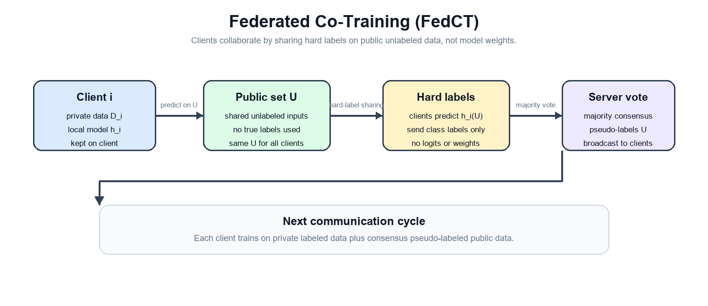
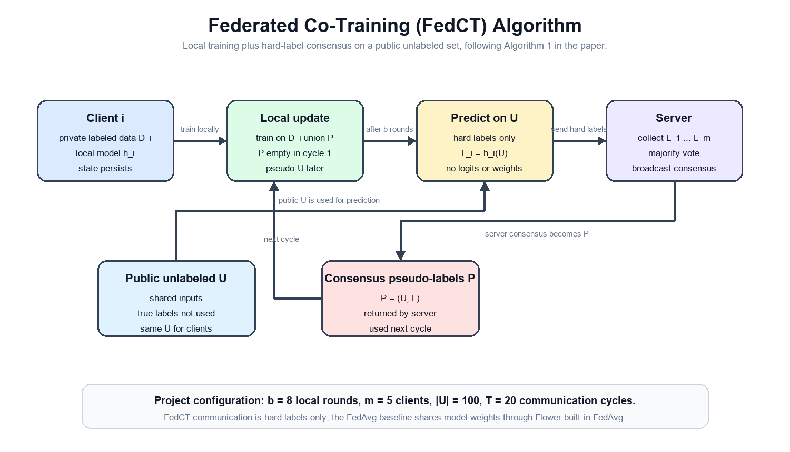
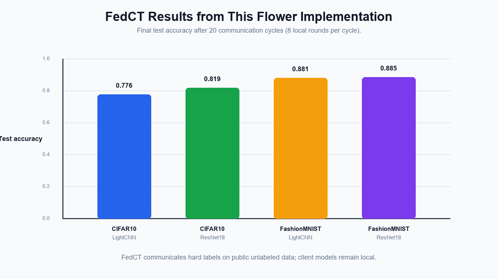
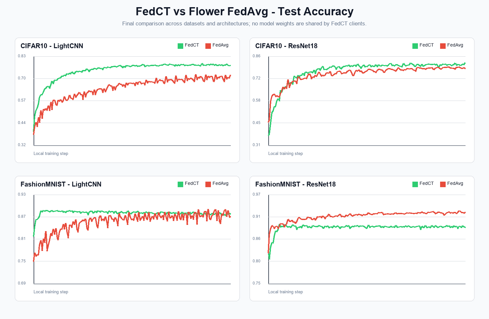
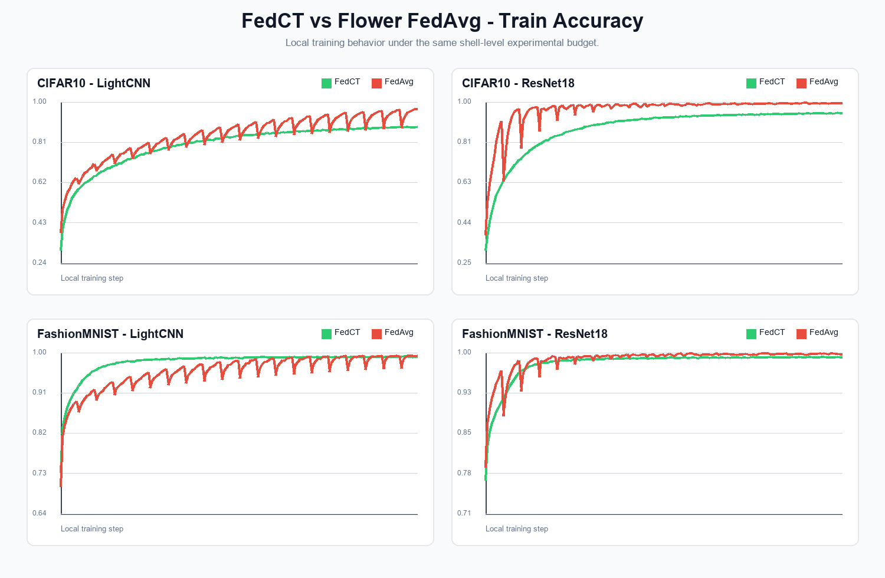

# FedCT: Federated Co-Training with Hard-Label Communication in Flower

> Note: If you use this implementation in academic work, please cite the original FedCT paper as well as the Flower framework.

**Paper:** [arxiv.org/abs/2310.05696](https://arxiv.org/abs/2310.05696)

**Authors:** Amr Abourayya, Jens Kleesiek, Kanishka Rao, Erman Ayday, Bharat Rao, Geoffrey I. Webb, Michael Kamp

**Implemented method:** Federated Co-Training (FedCT), a federated semi-supervised learning approach where clients share only hard-label predictions on a public unlabeled dataset.

**Baseline used for evaluation:** Flower built-in FedAvg, used only as a comparison baseline.



## About this Implementation

**What is implemented:** This repository implements the main FedCT training loop with Flower. Each client keeps a private local model, trains on its own labeled data, predicts hard labels on a shared public unlabeled set, and receives consensus pseudo-labels from the server.

**What is not shared in FedCT:** private samples, private labels, model parameters, gradients, logits, or soft probabilities.

**What is shared in FedCT:** hard class labels over the public unlabeled dataset.

**Why this matters:** The paper argues that hard-label sharing can preserve model quality while reducing privacy leakage compared with parameter sharing or soft-label sharing. In the paper's privacy evaluation, vulnerability values close to `0.5` correspond to membership inference attacks behaving close to random guessing.

**FedAvg role in this repository:** FedAvg is not the main method. The baseline is implemented as a separate Flower app, and the server-side aggregation uses Flower's built-in FedAvg strategy instead of a manually implemented averaging routine:

```python
from flwr.server.strategy import FedAvg
```

## Method Summary

FedCT assumes that each client has a private labeled dataset and that all clients can access the same public unlabeled dataset. At each communication cycle, local models improve their predictions, the server forms a consensus over hard labels, and the consensus labels are used as pseudo-labels in the next cycle.

The implementation follows the main structure of Algorithm 1 in the paper:



```text
Input:
  private client datasets D_1, ..., D_m
  public unlabeled dataset U
  communication period b
  total communication cycles T

At each client i:
  train local model h_i on D_i union P
  every b local rounds:
    predict hard labels L_i = h_i(U)
    send L_i to server
    receive consensus labels L
    update pseudo-labeled public set P = (U, L)

At the server:
  receive L_1, ..., L_m
  compute consensus labels, here by majority vote
  send consensus labels back to clients
```

This is different from FedAvg. In FedAvg, clients send model weights or updates and the server aggregates them. In FedCT, the local models remain separate and the server aggregates only predicted hard labels on public unlabeled samples.

## Experimental Setup

**Task:** Image classification.

**Datasets:** CIFAR10 and FashionMNIST.

**Models:** LightCNN and ResNet18.

**Framework:** Flower simulation.

**FedCT implementation files:**

```text
fedcot/
  client_app.py      # FedCT client training, prediction, local state
  server_app.py      # communication cycles and majority voting
  task.py            # data loading, models, training, evaluation
```

**FedAvg baseline files:**

```text
baselines/fedavg_flower/
  app.py             # minimal Flower app using built-in FedAvg
  pyproject.toml     # separate baseline app configuration
```

### Dataset Details

| Dataset | Task | Image shape | Classes | Architectures used |
|---|---|---:|---:|---|
| CIFAR10 | Object classification | 32 x 32 x 3 | 10 | LightCNN, ResNet18 |
| FashionMNIST | Clothing classification | 28 x 28 x 1 | 10 | LightCNN, ResNet18 |

### Training Hyperparameters Used in This Repository

| Hyperparameter | Value |
|---|---:|
| Number of clients | 5 |
| Communication cycles | 20 |
| Local rounds per FedCT cycle | 8 |
| Total FedCT Flower fit rounds | 160 |
| FedAvg aggregation rounds | 20 |
| Local epochs per FedAvg aggregation | 8 |
| Optimizer | Adam |
| Learning rate | 0.001 |
| Private batch size | 64 |
| Public batch size | 32 |
| Public unlabeled size | 100 |
| Client CPU resources | 1 CPU |
| Client GPU resources | 0.2 GPU |

### Communication Round Interpretation

In the paper, a FedCT communication round means that clients train locally for a communication period and then communicate predictions on the public unlabeled dataset. In this Flower implementation:

```text
1 FedCT communication cycle
= 8 local training rounds
+ hard-label prediction sharing
+ majority voting at the server
+ pseudo-label update for the next cycle
```

Therefore, the default FedCT run uses:

```text
20 communication cycles x 8 local rounds = 160 Flower fit rounds
```

For the FedAvg baseline, one Flower round corresponds to one FedAvg aggregation round.

## Environment Setup

Create and activate a Python environment, then install the project requirements. The project expects Flower, PyTorch, torchvision, numpy, matplotlib, and Ray through Flower simulation.

```bash
python -m venv .venv
source .venv/Scripts/activate
pip install -e .
```

On Windows PowerShell, activate with:

```powershell
.\.venv\Scripts\Activate.ps1
```

If `python` is not available inside Git Bash, the shell files try to use:

```text
.venv/Scripts/python.exe
```

## Running the Experiments

Run all commands from the project root.

### FedCT

```bash
bash run_fedct_CIFAR10_LightCNN.sh
bash run_fedct_CIFAR10_ResNet18.sh
bash run_fedct_FashionMNIST_LightCNN.sh
bash run_fedct_FashionMNIST_ResNet18.sh
```

### FedAvg Baseline

FedAvg is provided only for comparison and runs as a separate Flower baseline app.

```bash
bash run_fedavg_CIFAR10_LightCNN.sh
bash run_fedavg_CIFAR10_ResNet18.sh
bash run_fedavg_FashionMNIST_LightCNN.sh
bash run_fedavg_FashionMNIST_ResNet18.sh
```

### Plotting

```bash
bash plot_comparison.sh
```

The generated plots are written to:

```text
plots/
```

## Current Experimental Results

The main goal of the current experiments is to verify that the Flower-based FedCT implementation trains correctly, keeps client models local, and achieves competitive accuracy using hard-label consensus. The following table reports the latest completed runs in this repository.

### FedCT Results



| Dataset | Model | FedCT Train Acc | FedCT Test Acc |
|---|---|---:|---:|
| CIFAR10 | LightCNN | 0.8845 | 0.7763 |
| CIFAR10 | ResNet18 | 0.9490 | 0.8187 |
| FashionMNIST | LightCNN | 0.9911 | 0.8807 |
| FashionMNIST | ResNet18 | 0.9911 | 0.8871 |

### Context with the FedAvg Baseline

FedAvg is included to check whether the FedCT implementation gives reasonable accuracy under the same small experimental budget. It is not the primary method of this repository.

| Dataset | Model | FedCT Test Acc | FedAvg Test Acc | Difference |
|---|---|---:|---:|---:|
| CIFAR10 | LightCNN | 0.7763 | 0.7220 | +0.0543 |
| CIFAR10 | ResNet18 | 0.8187 | 0.7833 | +0.0354 |
| FashionMNIST | LightCNN | 0.8807 | 0.8744 | +0.0063 |
| FashionMNIST | ResNet18 | 0.8871 | 0.9224 | -0.0353 |

### Paper Reference Values

The paper reports the following iid results for 5 clients in Table 1. These values are not directly one-to-one with this repository because the paper uses much larger public unlabeled sets and longer training schedules.

| Dataset | Method | Paper ACC | Paper VUL |
|---|---|---:|---:|
| CIFAR10 | FedCT | 0.77 +/- 0.003 | 0.52 |
| CIFAR10 | FedAvg | 0.77 +/- 0.020 | 0.73 |
| FashionMNIST | FedCT | 0.84 +/- 0.004 | 0.51 |
| FashionMNIST | FedAvg | 0.83 +/- 0.024 | 0.72 |

The paper's main claim is not that FedCT must always dominate FedAvg in accuracy. The claim is that FedCT can maintain comparable model quality while substantially improving privacy because the communication consists only of hard labels.

## Result Figures

The following figures summarize the current repository runs. The plots are useful for checking convergence behavior, but the report should interpret them as implementation-level evidence rather than a full reproduction of the original paper.

### Test Accuracy Curves



FedCT improves over the Flower FedAvg baseline on CIFAR10 for both LightCNN and ResNet18, while FashionMNIST is already a relatively easy dataset where both methods achieve high accuracy. For FashionMNIST with ResNet18, the FedAvg baseline obtains higher test accuracy in the current single-run setup.

### Train Accuracy Curves



## Important Differences from the Paper

The implementation is structurally aligned with Algorithm 1, but the experimental budget is smaller than the paper:

| Item | Paper | This repository |
|---|---:|---:|
| Clients for iid benchmark table | 5 | 5 |
| CIFAR10 public unlabeled size | 10,000 | 100 |
| FashionMNIST public unlabeled size | 50,000 | 100 |
| CIFAR10 training horizon shown in paper figure | up to 3,000 rounds | 160 FedCT Flower fit rounds |
| Main reported privacy metric | membership inference vulnerability | not implemented yet |
| FedCT communication | hard labels | hard labels |

This means the repository currently demonstrates the mechanism and gives preliminary accuracy results, but it is not yet a full-scale reproduction of the paper's complete privacy-utility evaluation.

## Additional Implementation Details

FedCT requires persistent client-side model state. This is important because FedCT does not receive a global model from the server every round. In this implementation, the FedCT client stores and reloads local model state through the Flower context state so that client learning continues across communication cycles.

The server coordinates local training cycles and performs majority voting over hard labels. The consensus labels are then sent back to clients and used to construct the pseudo-labeled public dataset for the next cycle.

The FedAvg baseline remains separate from the FedCT code path. It uses Flower's built-in strategy and exists only to provide a familiar reference point for the reported accuracy curves.

## Limitations

- Privacy vulnerability and membership inference evaluation are not implemented yet.
- The public unlabeled dataset is much smaller than in the paper.
- The current results are single-run logs, not averages over multiple seeds.
- Windows Ray simulation can be unstable for heavy GPU runs, especially with ResNet18.
- FashionMNIST with ResNet18 currently favors the FedAvg baseline in test accuracy.

## Recommended Next Experiments

To move closer to the paper's setting, increase the public unlabeled set size and train for more communication cycles:

```bash
COMM_ROUNDS=70 LOCAL_ROUNDS=10 UNLABELED_SIZE=1000 LR=0.001 bash run_fedct_CIFAR10_LightCNN.sh
```

For a stronger CIFAR10 reproduction, use a larger public unlabeled set:

```bash
OPTIMIZER=SGD LR=0.01 COMM_ROUNDS=300 LOCAL_ROUNDS=10 UNLABELED_SIZE=10000 bash run_fedct_CIFAR10_LightCNN.sh
```

For Windows GPU memory issues, reduce batch size:

```bash
BATCH_SIZE=16 PUBLIC_BATCH=16 bash run_fedct_FashionMNIST_ResNet18.sh
```

## Citation

```bibtex
@inproceedings{abourayya2025little,
  title={Little is Enough: Boosting Privacy by Sharing Only Hard Labels in Federated Semi-Supervised Learning},
  author={Abourayya, Amr and Kleesiek, Jens and Rao, Kanishka and Ayday, Erman and Rao, Bharat and Webb, Geoffrey I. and Kamp, Michael},
  booktitle={Proceedings of the AAAI Conference on Artificial Intelligence},
  year={2025}
}
```

## Reference

Abourayya, A., Kleesiek, J., Rao, K., Ayday, E., Rao, B., Webb, G. I., and Kamp, M. **Little is Enough: Boosting Privacy by Sharing Only Hard Labels in Federated Semi-Supervised Learning**. AAAI, 2025.
